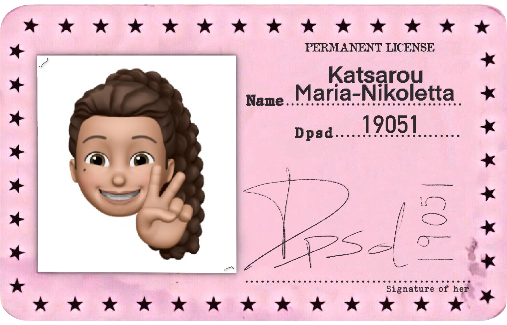

# Lesson: Interaction Design

### First and Last Name: :id: Maria-Nikoletta Katsarou
### University Registration Number: dpsd19051
### GitHub Personal Profile: [@MaritettaKatsarou](https://github.com/MaritettaKatsarou)
### Augmented Reality [Personal Repository](https://maritettakatsarou.github.io/Augmented-Reality/)

# Introduction

# ~~Summary~~ Notes
### Για όλα τα deliverables χρησιμοποιήθηκε το [Atom](https://atom.io) για την σύνταξη του κώδικα.

# :cherry_blossom: 1st Deliverable
### :pushpin: 1st step: Έγινε η εισαγωγή των σχημάτων με τη βοήθεια του κώδικα απο το: [A-Frame School](https://glitch.com/~aframe-school-position) 
 *// έγινε χρήση του εργαλείου μορφοποίησης κώδικα, (prettier), για να είναι πιο ευανάγνωστος //*
### :pushpin: 2nd step: Άλλαξα τα χρώματα, τις διαστάσεις και την τοποθεσία κάθε σχήματος 
 *// ώστε να είναι "μπλεγμένα" μεταξύ τους και να δημιουργήσουν κάτι που να μοιάζει με μικρόφωνο //*
### :pushpin: 3rd step: Απο μελέτη του [A-Frame Particle System](https://www.npmjs.com/package/aframe-particle-system-component) βρήκα το πως εντάσσουμε το χιόνι στο σκηνικό
### :pushpin: 4th step: Στη συνέχεια, απο το [NPM](https://www.npmjs.com/) βρήκα τον κώδικα για το [Speech Command](https://www.npmjs.com/package/aframe-speech-command-component)
 *// Σε καποιο ενδιαμεσο σταδιο αποφασησα να αλλαξω και το title σε Maritetta's_MarkerBased για να το κανω πιο personalised //*
 
 *//Γενικότερα, αντιμετώπισα διάφορα θέματα με την εργασία και γι'αυτό εχω κάνει και τοσες φορες upload και επειδή ίσως το κυρίως πρόβλημα είναι του laptop μου, ελπίζω να παίζει σε όποιον άλλο το δοκιμάσει//* 
 
# :cherry_blossom: 2nd Deliverable
### :pushpin: 1st step: Δημιούργησα το περιεχόμενο του marker μου στο [Canva](https://www.canva.com) και το έκανα upload στο [AR.js Marker Training](https://ar-js-org.github.io/AR.js/three.js/examples/marker-training/examples/generator.html) για να παρω το .patt αρχείο που χρειαζόμαστε.
 *// το 1ο marker δεν έπαιζε οπότε αποφάσισα να το αλλάξω :thinking://*
 
 *// ούτε το 2ο δεν έπαιζε :weary: έκανα διάφορες δοκιμές που δεν έπιασαν και μετά είπα να δοκιμάσω να βαλω πιο πολυ περιθώριο στο marker μου το οποίο επίσης δεν λειτούργησε. Μετά είδα σε κάποιο chat στο GitHub πως σε ένα άτομο που είχε παρόμοιο πρόβλημα με εμένα του πρότειναν να βάλει στο marker του background color το (240,240,240) δλδ γκρί οπότε το δοκίμασα και εγώ και δούλεψε) :+1: //*
 
 Βέβαια δεν το έκανα upload στο link που αναφέρει
 
 ### :pushpin: 2nd step: Δημιούργησα την παρακάτω εικόνα που ήθελα να εμφανίζεται (με τη χρήση του ProCreate στο ipad και την ανεβασα στα assets αφού πρώτα την έκανα reverse μέσω του [ResizePixel](https://www.resizepixel.com/mirror-image) γιατί αλλιώς φαινόταν ανάποδα )
 
 

# :cherry_blossom: 3rd Deliverable 

# Conclusions

# Sources are linked throughout the text
 
:cherry_blossom: :cherry_blossom: :cherry_blossom:
